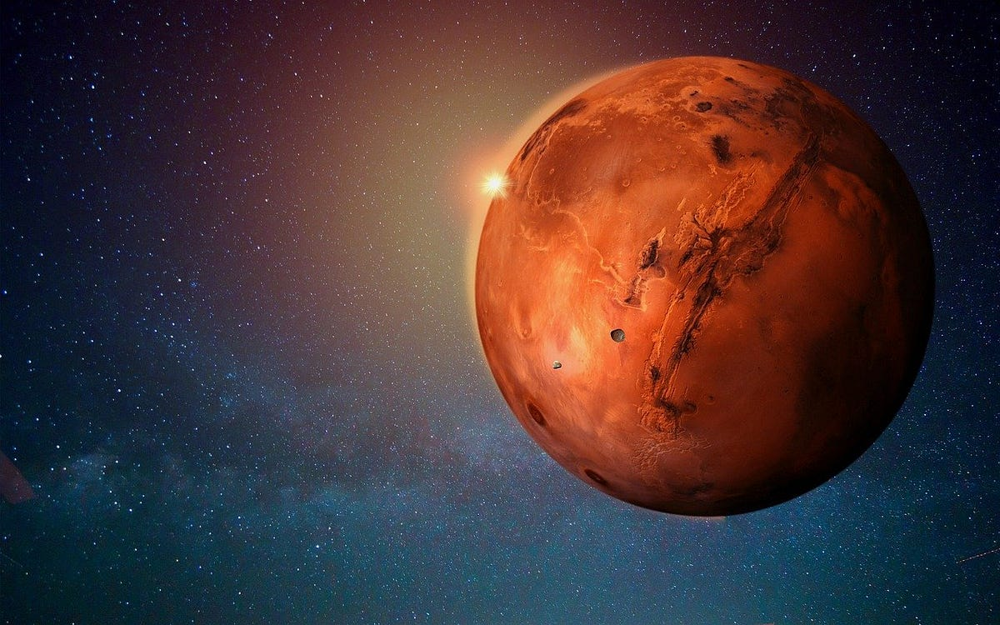
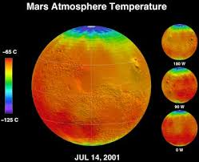
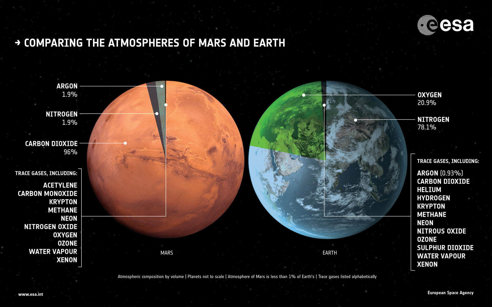
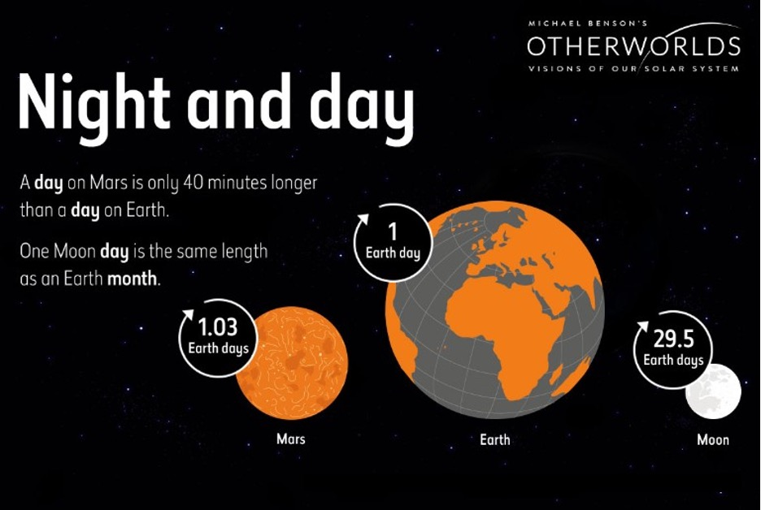

# Mars Data Analysis Project

This project focuses on scraping and analyzing data related to Mars news and weather patterns, using two Jupyter notebooks: `part_1_mars_news.ipynb` and `part_2_mars_weather.ipynb`. The project is aimed at understanding key aspects of Mars' climate and providing insights for future Mars missions.

## Files in this Repository

### 1. `part_1_mars_news.ipynb`
- **Purpose**: This notebook scrapes the latest Mars-related news, including titles and preview texts, from a designated website.
- **Description**: The notebook uses Python libraries such as BeautifulSoup and requests to gather data from a Mars news page. The scraped data is then formatted into a pandas DataFrame for further analysis.
- **Key Sections**:
  - Web scraping Mars news titles and preview texts.
  - Data cleaning and storage in a pandas DataFrame.
  - Summary of the most recent news articles related to Mars.

### 2. `part_2_mars_weather.ipynb`
- **Purpose**: This notebook focuses on analyzing Mars' weather data, particularly the minimum temperature and atmospheric pressure on Mars, using a scraped table of weather data.
- **Description**: It processes data from a Mars weather website and analyzes the patterns of temperature and pressure over time. The notebook creates visualizations to show monthly variations and provides insights into the Martian climate.
- **Key Sections**:
  - Web scraping Mars weather data from a table.
  - Data analysis of the minimum temperature by month.
  - Atmospheric pressure analysis by month.
  - Visualization of weather patterns on Mars.
  - Estimation of a Martian year's length using temperature cycles.

## Key Analyses

### Minimum Temperature on Mars
- **Coldest Month**: Month 3, with an average minimum temperature of **-83°C**.
- **Warmest Month**: Month 8, with an average minimum temperature of **-68°C**.
- **Implications**: These variations are important for mission planning, particularly for operating rovers and landers during harsh Martian winters.

### Atmospheric Pressure on Mars
- **Lowest Pressure**: Month 6, with an average pressure of **745 Pa**.
- **Highest Pressure**: Month 9, with an average pressure of **920 Pa**.
- **Implications**: Pressure changes impact dust storms, equipment operation, and solar power efficiency. Understanding these patterns is critical for planning landings and operations on Mars.

### Estimation of Martian Year Length
- **Length**: Approximately **687 Earth days**, derived from analyzing the cyclical temperature variations across Martian sols (days).
- **Implications**: Knowing the length of a Martian year and the associated temperature cycles helps mission planners adapt to the Martian seasons, particularly for solar-powered missions and human habitation.

## Tools Used
- **Python Libraries**:
  - `BeautifulSoup` for web scraping.
  - `requests` for making HTTP requests.
  - `pandas` for data manipulation and analysis.
  - `matplotlib` for visualizing data.

# Conclusion

## Analysis: Minimum Temperature on Mars

The analysis of the **minimum temperature** by month on Mars shows interesting seasonal variations. Mars experiences significant temperature fluctuations based on the time of year, driven by its orbit and axial tilt.

From the data and the plot:
1. **Coldest Month**: The coldest month on Mars appears to be **Month 3**, with an average minimum temperature of around **-83°C**. This suggests that during this period, Curiosity's location experiences its harshest winter conditions, likely influenced by the distance from the Sun and the atmospheric conditions on Mars.
   
2. **Warmest Month**: The warmest month appears to be **Month 8**, with an average minimum temperature of about **-68°C**. While still extremely cold by Earth standards, this indicates that Mars experiences slightly warmer periods, which could coincide with a season closer to the Sun or milder weather patterns.

## Atmospheric Pressure on Mars: Analysis

The analysis of the average atmospheric pressure by month at Curiosity’s location on Mars reveals significant monthly variations. Atmospheric pressure is a crucial factor for both scientific research and future missions, as it impacts various aspects such as weather patterns, dust storms, and the operation of equipment.

From the sorted data and plot:

1. **Lowest Pressure Month**: The lowest atmospheric pressure occurs in Month 6, with an average pressure of around 745 Pa. This suggests that during this time, the Martian atmosphere is at its thinnest, which could correspond to a period of colder temperatures (likely winter at Curiosity's location). Thin atmospheric pressure could also be associated with increased dust storm activity and reduced solar power efficiency.

2. **Highest Pressure Month**: The highest atmospheric pressure is recorded in Month 9, with an average pressure of around 920 Pa. This indicates that the atmosphere is at its thickest during this period, which may correspond to a warmer season. Thicker atmosphere conditions are generally more favorable for exploration equipment, as it helps with heat retention and potentially reduces the harshness of environmental conditions.

## Year Length on Mars: Analysis

To estimate the length of a Martian year (the time it takes for Mars to orbit the Sun), we can analyze the daily minimum temperature over time. Mars has a longer orbital period compared to Earth, so a Martian year is significantly longer than an Earth year.

From the plot and data analysis, here are the key insights:

1. **Martian Year Overview**:
    - A Martian year is equivalent to about 687 Earth days. This is nearly double the length of an Earth year, primarily due to Mars being farther from the Sun, which makes its orbit larger and longer.
    - By tracking the minimum daily temperature over time, we observe seasonal fluctuations that repeat over approximately 687 Earth days, corresponding to one complete Martian orbit around the Sun.

2. **Daily Temperature Variations**:
    - The daily minimum temperatures show cyclical patterns. These cycles reflect the changing seasons on Mars, much like how temperatures fluctuate throughout the year on Earth.
    - By identifying the periodic rise and fall of temperatures (from colder winters to relatively warmer summers), we can visually estimate the length of a Martian year.

3. **Temperature as an Indicator of Martian Seasons**:
    - During Martian winter, temperatures drop to their lowest points, and the atmospheric pressure decreases. This is typically observed around specific sols (Martian days) in the dataset.
    - As Mars moves toward Martian summer, temperatures increase, and atmospheric pressure rises, indicating a warmer and more stable period.

4. **Terrestrial Days in a Martian Year**:
    - The Martian seasons and temperature fluctuations help estimate how many Earth days elapse over a full Martian year. Since Mars takes about 687 Earth days to complete one orbit, we can visually confirm this by plotting temperature data across sols and observing where the cycle repeats itself.
    - This cyclical temperature trend aligns with the understanding that a Martian year is almost twice the length of an Earth year.

### Implications for Mars Missions:

- **Human Habitation**: Future crewed missions will need to adapt to the longer seasons and harsher winter conditions on Mars. Knowing the exact length of Martian seasons can help astronauts prepare for temperature extremes and shifts in atmospheric pressure.

